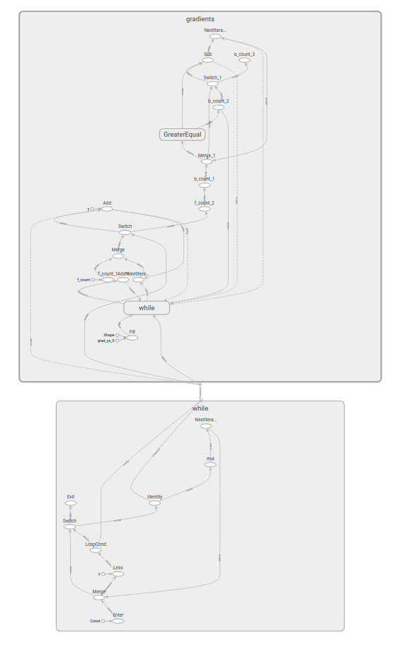
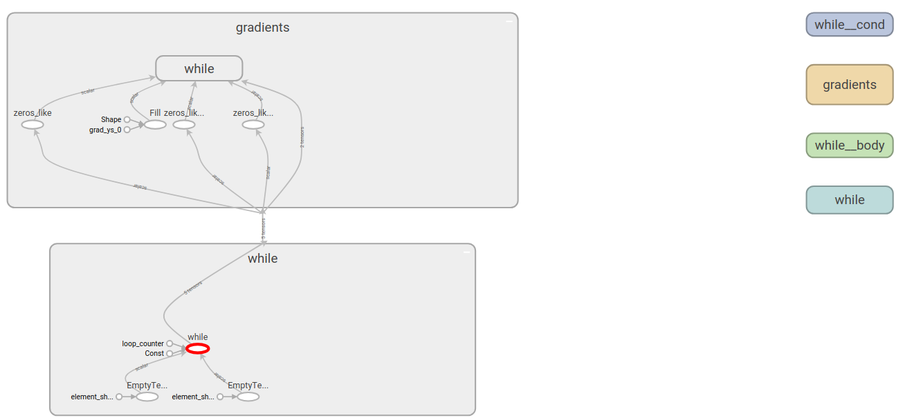
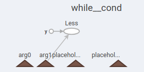
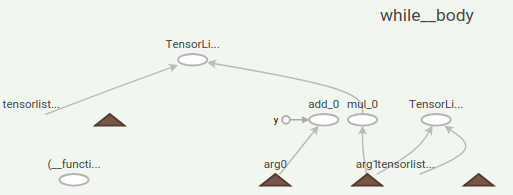

# Functional while_loop
| Status        | Accepted                                             |
:---------------|:-----------------------------------------------------|
| **Author** | Saurabh Saxena (Google) |
| **Sponsor**   | Skye Wanderman-Milne (Google)                 |
| **Updated**   | 2018-08-23                                           |


## Objective

This proposal talks about an implementation of [while_loop](https://www.tensorflow.org/api_docs/python/tf/while_loop) which adds a single While op to the GraphDef as opposed to the current implementation that uses [lower level primitives](https://arxiv.org/abs/1805.01772). The goal is to simplify debugging and other analysis and to make it easier for compiler backends like XLA to [recognize](https://github.com/tensorflow/tensorflow/blob/master/tensorflow/compiler/tf2xla/functionalize_while.cc) the while loop in the GraphDef. At runtime, a C++ optimization pass will lower this op to the primitive dataflow ops for feature parity with the current implementation similar to how we do for the [If op](https://github.com/tensorflow/tensorflow/blob/master/tensorflow/core/common_runtime/lower_if_op.cc).


## Motivation

TensorFlow provide two flavours of control flow constructs which differ widely in the way they manifest themselves in the GraphDef:


1.  Functional ops which create a single node in the Graph: [If](https://github.com/tensorflow/tensorflow/blob/fc4504edb1ab419ae59b0ebb9ff8d943beb61117/tensorflow/core/ops/functional_ops.cc#L104), [While](https://github.com/tensorflow/tensorflow/blob/fc4504edb1ab419ae59b0ebb9ff8d943beb61117/tensorflow/core/ops/functional_ops.cc#L147).
1.  Non-functional ops which make use of primitive control flow constructs namely Enter, Exit, Switch, Merge and NextIteration: [tf.cond](https://www.tensorflow.org/api_docs/python/tf/cond), [tf.while_loop](https://www.tensorflow.org/api_docs/python/tf/while_loop).

Both approaches have their merits and demerits. The functional representation emits a single node in the GraphDef thus making it easy to recognize such ops in processing pipelines that operate on the GraphDef, which is not the case when control flow is represented using lower level primitives. The functional representation is however not easily differentiable and requires using the [SymbolicGradient](https://github.com/tensorflow/tensorflow/blob/a0e76ce73c5f095fc61e06c19ff8e653cfd2965c/tensorflow/core/ops/functional_ops.cc#L24) op which recomputes the forward pass(slow) and needs symbolic gradients defined for all ops in the function body which can be complicated to implement. Also since we force a strict execution of functions, i.e., a function can start executing only after its inputs are all ready, the functional ops may not be that performant. The current representation solved these problems at the cost of a slightly complicated GraphDef. In this proposal, we try to achieve the best of both worlds.

We recently added a differentiable version of the [functional If/cond op](https://github.com/tensorflow/community/blob/master/rfcs/20180507-cond-v2.md). As with functional cond, a key challenge here is to figure out gradient computation. For cond, we could expose the [intermediate tensors](https://github.com/tensorflow/tensorflow/blob/51100a8de57ef53e36a8a9f5a9829cbd33fbed04/tensorflow/python/ops/cond_v2_impl.py#L114) as op outputs so that they could be used for computing gradients. We cannot directly do the same for while loops since we would need the intermediate values _for all iterations_ and not just the values after the last iteration. Hence, some sort of accumulator is required. We use TensorLists for accumulating the loop body intermediates. Since while loops may run for a large number of iterations, e.g. long RNNs,  we need to be mindful of the memory usage by accumulators.


## Design Proposal


### Accumulating intermediates


#### Stack vs TensorArray vs TensorList

The current implementation uses [Stacks](https://github.com/tensorflow/tensorflow/blob/51100a8de57ef53e36a8a9f5a9829cbd33fbed04/tensorflow/python/ops/control_flow_ops.py#L1002) for accumulating intermediate values from the forward pass that may be needed for gradient computation. This implementation will use [TensorLists](https://github.com/tensorflow/tensorflow/blob/master/tensorflow/core/ops/list_ops.cc)(TL) instead which, unlike Stack and TensorArray, do not have a mutable internal state making them easy to differentiate.


#### Algorithm

For each intermediate tensor of the while loop function body that may be needed for gradient computation, we create an empty TensorList and add it to the list of loop_vars. We then push the intermediate values to the TL using the [TensorListPushBack](https://github.com/tensorflow/tensorflow/blob/master/tensorflow/core/ops/list_ops.cc#L40) op. Note that this way we may be accumulating more tensors than are actually needed for gradient computation. It is even possible that the graph is just used for inference and hence we do not need the accumulators at all! We rely on the [C++ optimization pass](https://github.com/tensorflow/tensorflow/blob/master/tensorflow/core/grappler/optimizers/model_pruner.cc) that happens after the While op is lowered to remove all such superfluous accumulators. So adding extra accumulators will not have any performance or memory overhead at runtime.

To facilitate use-cases where lowering is not desired we can perform a few optimizations to the functional form of the While op:

*   Expose only those intermediate values that are required by the backward pass by building the gradient graph in the forward pass.
    *   This will increase graph building time.
*   Do not accumulate Const nodes. We can lift these outside the while loop.
*   Do not accumulate loop vars that are passed-through unchanged.
*   Rewrite the forward pass to add accumulators when gradients are requested.
    *   This will require creating a new While op and new FunctionDefs for the loop condition and body.
    *   Since we cannot remove nodes from the Graph there will be unused functions and the dangling While op in the GraphDef. These will however be pruned out at runtime and hence will not affect performance or correctness.


### Computing gradients

Excerpt from white paper on [Control Flow in TensorFlow](http://download.tensorflow.org/paper/white_paper_tf_control_flow_implementation_2017_11_1.pdf):

> Intuitively, the gradient of `while_loop(pred, body)` is just a while loop of the form:
>
>
> ```
> def pred(i, _): return i < N
> while_loop(pred, g_body, [0] + g_vars)
> ```
>
> Where `N` is the number of iterations that the forward while loop runs, `g_body` is the gradient of the forward loop body, and `g_vars` is the initial values for the loop variables. As we will see later, `g_vars` includes the initial gradients for the loop variables of the forward while loop.

We use the same logic here as well. To get a count of the number of forward iterations we add an integer counter which is initialized to 0 and is incremented in the loop body. Note that we just need the total number of iterations for the gradient pass so we do not need to accumulate the intermediate values of the counter. This counter is always the first output of the While op.

To compute *g_body* we use the [gradients_impl._GradientsHelper](https://github.com/tensorflow/tensorflow/blob/600caf99897e82cd0db8665acca5e7630ec1a292/tensorflow/python/ops/gradients_impl.py#L599) function which supports computing the gradient of a given [src_graph](https://github.com/tensorflow/tensorflow/blob/600caf99897e82cd0db8665acca5e7630ec1a292/tensorflow/python/ops/gradients_impl.py#L607) in another graph, which in this case is a [_FuncGraph](https://github.com/tensorflow/tensorflow/blob/600caf99897e82cd0db8665acca5e7630ec1a292/tensorflow/python/framework/function.py#L621). This gradient graph captures references to the intermediate values of the forward graph(the src_graph). We replace these references with popped values from the accumulators of the intermediate tensors. Note that these accumulators were already added to the list of loop_vars of the While op and hence were in the list of outputs of the forward While op.

We will register a custom python [gradient function](https://github.com/tensorflow/tensorflow/blob/0440ccfc199cbffc10aae19fde07f0100c823ed9/tensorflow/python/framework/ops.py#L2352) to compute the gradient of a functional While op. This will allow taking the gradient of any functional While op(not only the ones generated by the new while_loop function) which satisfies the following conditions:


1.  The first loop output must be the number of loop iterations.
1.  Each intermediate tensor of the While body which may be needed during gradient computation must be accumulated in a TensorList. We will check to make sure that the TensorList is indeed unique to the intermediate value.
1.  The position of the accumulator in the list of inputs and outputs must be the same.

The While op generated by the gradient function satisfies the above constraints and hence can be differentiated again to generate the 2nd order derivative and so on.

In the case of nested while loops, we will accumulate the intermediate values of inner while loops in nested TensorLists.


### Memory management

tf.while_loop swaps the tensors from GPU to CPU when the [swap_memory](https://github.com/tensorflow/tensorflow/blob/600caf99897e82cd0db8665acca5e7630ec1a292/tensorflow/python/ops/control_flow_ops.py#L3046) flag is set. Section 5.3 of the control flow [paper](https://arxiv.org/abs/1805.01772) mentions that with memory swapping they were able to handle an RNN with 2x the unrolled length(1000 vs 500) with little overhead. The heuristics for memory swapping are implemented in the [StackPush](https://github.com/tensorflow/tensorflow/blob/600caf99897e82cd0db8665acca5e7630ec1a292/tensorflow/core/kernels/stack_ops.cc#L289) and [StackPop](https://github.com/tensorflow/tensorflow/blob/600caf99897e82cd0db8665acca5e7630ec1a292/tensorflow/core/kernels/stack_ops.cc#L411) ops. We will need to support similar functionality for TensorListPushBack and TensorListPopBack ops.


### Lowering pass

In order to get feature parity with the current implementation we will lower the While op to the current while loop graph representation as a grappler pass similar to the one for [if_op](https://github.com/tensorflow/tensorflow/blob/master/tensorflow/core/common_runtime/lower_if_op.cc). This gets us around some of the issues with the current functional op:


1.  We can perform parallel iterations which are not possible due to the strict mode execution of functions which requires that all inputs to the function must be ready before the function can start executing. We will need to add a `parallel_iterations` attr to the While op.
1.  The FunctionLibraryRuntime currently does not allow running multi-device functions.
1.  We can perform global grappler optimizations without needing to cross function boundaries. E.g. we can remove accumulators for intermediate values which are not consumed downstream.


### Example

```python

x = tf.constant(2.)

ret = while_loop(lambda v: v < 8., lambda v: v * v, [x])

grad = tf.gradients(ret, [x])

```

**Current implementation**





**New implementation**





The forward functional while op is highlighted in <span style="color:#ff0000;">red</span>. Note that it takes 2 `Const` nodes as inputs. One of the `Const` nodes is `x` with value 2. The other `Const` node is the initial value of the loop counter which is set to 0. There are also 2 `EmptyTensorList` nodes which are used for accumulating intermediate values.

*while_cond*

The loop condition function is fairly trivial. It expects the extra args for the loop counter and accumulators but doesn't actually use them.





*while_body*

The loop body contains the extra nodes for updating the counter and accumulating intermediates.





`arg0` is the loop counter which gets initialized to 0. This is always the first argument.

`arg1` is the value of x at the start of each iteration.

`add_0` is the counter update node and `y` is the increment `Const` node with value 1.

`mul_0` performs `x * x`


Accumulators:

`tensorlist0` <- `arg1`, the value of `x` at the start of the loop.

`tensorlist1` <- Output of `mul_0`.

## Discussion notes

Please see notes in [tensorflow/community#13](https://github.com/tensorflow/community/pull/13#issuecomment-422591773).
